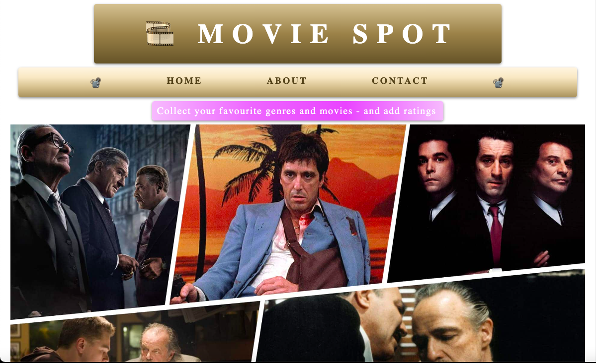

# MOVIE SYSTEM CLIENT

## User Interface



## Description 

This is an application where users can add their favourite genres and movies to a personal users page - as well as add ratings for movies they have watched. Users are rendered on the page from a database set up in Azure Datastudio and information is exchanged with the database via a [Movie System Server](https://github.com/AnnaAxelsson051/Movie-System-Server) I have built. The server is built with C# / .NET and it also fetches data from The Movie Database (TMDB) via an external API.


---

## Technologies used:

- Vite / React
- Azure Datastudio
- SQL
- React Router
- Styled Components
- Axios
- HTML
- CSS

---

## Instructions 

Clone the project and open the project folder in VS Code. Modify the base URL for the API and add your personal TMDB API-key. Open a terminal and navigate in to the project folder.

Install the required packages:

```
npm install 
```
Start the application:
```
npm run dev 
```